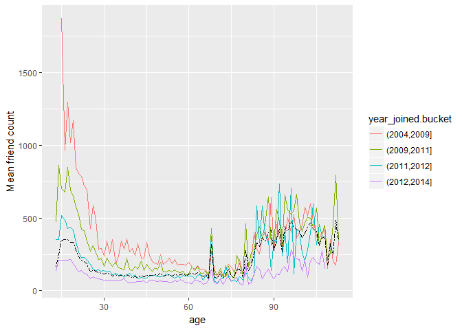

# Pseudo facebook data analysis
Menna Mustafa  
February 2, 2018  


##Data and packages
###Link to download data: https://drive.google.com/open?id=194SQBOx0o3fxtRKlFd3J39hOytG5tvMJ

```r
library(dplyr)
library(gridExtra)
library(ggplot2)
library(reshape2)
library(GGally)
library(alr3)


fb <- read.delim("F:\\GP\\R\\Data anlysis with R\\lesson3\\pseudo_facebook.tsv")
```

##Explore users birthdate day

```r
qplot(data=fb, x=dob_day) + 
  geom_histogram(binwidth = 1) +
  scale_x_continuous(breaks = 1:31) +
  facet_wrap(~dob_month, ncol=3)
```

<!-- -->

###All months nearly same, except for first day of the year because many users leave the default date or maybe because generally we have more users with the date really.

##Explore friend count distribution

```r
qplot(data=fb, x=friend_count, xlim = c(0,1000))
```

<!-- -->


```r
qplot(x = friend_count, data = fb, binwidth = 10) +
  scale_x_continuous(limits = c(0, 1000),
                     breaks = seq(0, 1000, 50))
```

<!-- -->


##Explore friend count distribution by gender

```r
qplot(data=na.omit(fb), x=friend_count, binwidth=25) +
  scale_x_continuous(limits = c(0,1000), seq(0,1000,50)) +
  facet_wrap(~gender, ncol=1)
```

<!-- -->

###Let's see what does this histogram tell us


```r
by(fb$friend_count, fb$gender, summary)
```

```
## fb$gender: female
##    Min. 1st Qu.  Median    Mean 3rd Qu.    Max. 
##       0      37      96     242     244    4923 
## -------------------------------------------------------- 
## fb$gender: male
##    Min. 1st Qu.  Median    Mean 3rd Qu.    Max. 
##       0      27      74     165     182    4917
```

###Females have on average more friends!

##Exploring tenure by years: how many days since user first create the account divided by 365

```r
qplot(data=fb, x=tenure/365,
      color=I('black'), fill=I('#099DD9'), binwidth=0.25, xlab = "Tenure by year", ylab="number of users"
      ) +
  scale_x_continuous(breaks = seq(1,7,1), limits = c(0,7))
```

<!-- -->

##Explore age of our users

```r
ggplot(aes(x = age), data = fb) +
  geom_histogram(binwidth = 1, color=I('black'), fill = '#5760AB') +
  scale_x_continuous(breaks = seq(0, 113, 5))
```

<!-- -->

##Transforming friend count to explore


```r
p1= qplot(data=fb, x=friend_count, color=I('black'))
p2= qplot(data=fb, x=log10(friend_count+1), color=I('black')) #using log base 10
p3= qplot(data=fb, x=sqrt(friend_count), color=I('black')) #using square root

grid.arrange(p1,p2,p3,ncol=1)
```

<!-- -->

###Square root gives us nearly normal version of our variable

##Explore friend count for each gender using frequency polygons

```r
qplot(data=subset(fb, !is.na(gender)), x=friend_count, binwidth=10, geom = 'freqpoly', color=gender) +
  scale_x_continuous(lim=c(0,1000), breaks = seq(0,1000,50))
```

<!-- -->

###Explore proportion of users instead of count

```r
qplot(data=subset(fb, !is.na(gender)), x=friend_count,y=..count../sum(..count..), 
      binwidth=10, geom = 'freqpoly', color=gender,
      xlab = "Friend count",
      ylab = "Proportion of users with that friend count"
      ) +
  scale_x_continuous(lim=c(300,1000), breaks = seq(0,1000,50))
```

<!-- -->

##Explore friend count for each gender using boxplot to check for outliers


```r
qplot(geom='boxplot',data=subset(fb, !is.na(gender)), y=friend_count, x=gender) +
  coord_cartesian(ylim=c(0,250))
```

<!-- -->

##Exploring: Who is initiating friendships more? males or females?


```r
qplot(geom='boxplot', x=gender, y=friendships_initiated,data=subset(fb, !is.na(gender)))+
  coord_cartesian(ylim=c(0,250))
```

<!-- -->

###Unexpected!

##Explore mobile check-in

```r
mobile_check_in <- NA
fb$mobile_check_in <- factor(ifelse(fb$mobile_likes >0, 1,0))
summary(fb$mobile_check_in)
```

```
##     0     1 
## 35056 63947
```

```r
(summary(fb$mobile_check_in)[2]/dim(fb)[1])*100
```

```
##        1 
## 64.59097
```

```r
#or
sum(fb$mobile_check_in==1)/length(fb$mobile_check_in)*100
```

```
## [1] 64.59097
```

###Cool, 64.5% of our users make mobile check-in

##Explore number of likes users received from friends on the desktop version of the site (www_likes_received) Vs. total likes received (likes_received)


```r
ggplot(aes(x=www_likes_received, y=likes_received), data=fb, xlab=) + 
  geom_point(color='blue')
```

<!-- -->

###Is there a storng correlation?

```r
ggplot(aes(x=www_likes_received, y=likes_received), data=fb) + 
  geom_point() +
  xlim(0, quantile(fb$www_likes_received, 0.95)) +
  ylim(0, quantile(fb$likes_received, 0.95)) +
  geom_smooth(method = 'lm', color='red')
```

<!-- -->

###Confirm by calculate the correlation coefficient

```r
r <- cor.test(fb$www_likes_received, fb$likes_received, method='pearson')
round(r$estimate,3)
```

```
##   cor 
## 0.948
```

##


##Explore how many likes users make for each gender

```r
qplot(data=subset(fb, !is.na(gender)), x=www_likes, color=gender, geom='freqpoly',
      xlab="Number of likes made",
      ylab="Users make this number of likes") +
  scale_x_continuous() +
    scale_x_log10()
```

<!-- -->


##User age Vs. Friends count

```r
ggplot(aes(x=age, y=friend_count), data=fb) +
  geom_point()
```

<!-- -->

###Change x-axis scale for better results

```r
ggplot(aes(x=age, y=friend_count), data=fb)+
  geom_point() +
  xlim(13,90)
```

<!-- -->

###Using overplotting


```r
ggplot(aes(x=age, y=friend_count), data=fb)+
  geom_jitter(alpha=1/20) +
  xlim(13,90)
```

<!-- -->

###It seems like young users have more friends, max 1000 approximately

###Taking the square root of the friend count

```r
ggplot(aes(x=age, y=friend_count), data=fb)+
  geom_point(alpha=1/20, position = position_jitter(h=0)) +
  xlim(13,90) +
  coord_trans(y="sqrt")
```

<!-- -->

##Age Vs. initiated friendships


```r
ggplot(aes(x=age, y=friendships_initiated), data=fb) +
  geom_jitter(alpha=1/10, position = position_jitter(h=0))+
  xlim(13,90)+
  coord_trans(y='sqrt')
```

<!-- -->

###Seems like our young users are more social!

##Let's group our users by their age, then check mean and median friendcount for each age group to see the big picture!


```r
# Create new data frame for our age grouped users
fb.fc_by_age <- fb %>% 
  group_by(age) %>% 
  summarise(friend_count_mean=mean(friend_count),
            friend_count_median=median(friend_count),
            n=n()) %>% 
  arrange(age)

fb.fc_by_age
```

```
## # A tibble: 101 × 4
##      age friend_count_mean friend_count_median     n
##    <int>             <dbl>               <dbl> <int>
## 1     13          164.7500                74.0   484
## 2     14          251.3901               132.0  1925
## 3     15          347.6921               161.0  2618
## 4     16          351.9371               171.5  3086
## 5     17          350.3006               156.0  3283
## 6     18          331.1663               162.0  5196
## 7     19          333.6921               157.0  4391
## 8     20          283.4991               135.0  3769
## 9     21          235.9412               121.0  3671
## 10    22          211.3948               106.0  3032
## # ... with 91 more rows
```

###Let's visualize!


```r
ggplot(aes(x=age, y=friend_count_mean), data=fb.fc_by_age)  +
  geom_line() + 
  xlim(13,90) +
  scale_x_continuous(breaks = seq(13,95,5))
```

<!-- -->

###Here we go with the young users again! and the peak at age 68 seems like not real peak maybe we have users that choose fake birthdate or choose default year maybe and same for the flactuation after 68 also.

###What if we use age by months not years? Let's group users first with age by months and visualize result


```r
fb$age_by_months <- (fb$age)+ (12 - fb$dob_month)/12
fb.fc_b_age_months <- group_by(fb, age_by_months) %>% 
  summarise(
            friend_count_mean=mean(friend_count),
            friend_cont_median=median(friend_count),
            n=n()) %>% 
  arrange(age_by_months)

ggplot(aes(x=age_by_months, y=friend_count_mean), 
       data=subset(fb.fc_b_age_months, age_by_months < 71)) +
  geom_line()
```

<!-- -->
###More noise, let's see different solutions (smoothing conditional means) for users <=70


```r
p1 <- ggplot(aes(x=age, y=friend_count_mean), 
       data=subset(fb.fc_by_age,age<71))+
  geom_line()+
  geom_smooth()

p2 <- ggplot(aes(x=age_by_months, y=friend_count_mean), 
       data=subset(fb.fc_b_age_months, age_by_months < 71)) +
  geom_line()+
  geom_smooth()

p3 <- ggplot(subset(fb, age<71), aes(x=round(age/5)*5, y=friend_count))+
  geom_line(stat = 'summary', fun.y=mean)

grid.arrange(p1, p2, p3, ncol=1)
```

<!-- -->

##For mean number of friends Vs. age, we are going to explore each quantile (10% - 50% - 90%)

```r
ggplot(aes(x=age, y=friend_count), data=fb)+
  geom_point(alpha=1/20, position = position_jitter(h=0), color='yellow') +
  coord_cartesian(xlim = c(13, 70)) +
  scale_x_continuous(breaks = seq(5,70,5))+
  geom_line(stat = 'summary', fun.y=mean) + 
  geom_line(stat = 'summary', fun.y=quantile, fun.args = list(probs = .9),
            linetype=2, color='blue') +
  geom_line(stat = 'summary', fun.y=quantile, fun.args = list(probs = .5),
            color='blue')+
  geom_line(stat = 'summary', fun.y=quantile, fun.args = list(probs = .1),
            linetype=2, color='blue')
```

<!-- -->

###Having more than 1000 friend is quite rare!, so we made y from 0 to 1000 and plot again

```r
ggplot(aes(x=age, y=friend_count), data=fb)+
  geom_point(alpha=1/20, position = position_jitter(h=0), color='yellow') +
  coord_cartesian(xlim = c(13, 70), y=c(0,1000)) +
  scale_x_continuous(breaks = seq(5,70,5))+
  geom_line(stat = 'summary', fun.y=mean) + 
  geom_line(stat = 'summary', fun.y=quantile, fun.args = list(probs = .9),
            linetype=2, color='blue') +
  geom_line(stat = 'summary', fun.y=quantile, fun.args = list(probs = .5),
            color='blue')+
  geom_line(stat = 'summary', fun.y=quantile, fun.args = list(probs = .1),
            linetype=2, color='blue')
```

<!-- -->


###Mean number of friends is nearly at 200 or less, check by summary function to confirm:


```r
summary(fb$friend_count)
```

```
##    Min. 1st Qu.  Median    Mean 3rd Qu.    Max. 
##     0.0    31.0    82.0   196.4   206.0  4923.0
```

##What's the correlation between age and friend count? 

```r
with(fb, cor.test(fb$age, fb$friend_count, method='pearson'))
```

```
## 
## 	Pearson's product-moment correlation
## 
## data:  fb$age and fb$friend_count
## t = -8.6268, df = 99001, p-value < 2.2e-16
## alternative hypothesis: true correlation is not equal to 0
## 95 percent confidence interval:
##  -0.03363072 -0.02118189
## sample estimates:
##         cor 
## -0.02740737
```

###Seems like no correlation? Let's explore it again but with users whose age <=70


```r
with(subset(fb, age <=70), cor.test(age, friend_count))
```

```
## 
## 	Pearson's product-moment correlation
## 
## data:  age and friend_count
## t = -52.592, df = 91029, p-value < 2.2e-16
## alternative hypothesis: true correlation is not equal to 0
## 95 percent confidence interval:
##  -0.1780220 -0.1654129
## sample estimates:
##        cor 
## -0.1717245
```

###Different!

##Moving to many vaiable exploration

###Mean age of males and females

```r
ggplot(aes(x = gender, y = age),
       data = subset(fb, !is.na(gender))) + 
  geom_boxplot()+
  stat_summary(fun.y = mean, geom = 'point', shape=4)
```

<!-- -->

###Median friend count of both males and females

```r
ggplot(aes(x=age, y=friend_count), data=subset(fb, !is.na(gender)))+
  geom_line(stat = 'summary', fun.y=median, aes(color=gender))
```

<!-- -->

##Grouping users by age AND gender we get same previous results


```r
pf.fc_by_age_gender <- subset(fb, !is.na(gender)) %>% 
  group_by(age, gender) %>% 
  summarise(
    mean_friend_count = mean(friend_count),
    median_friend_count = median(friend_count),
    n=n()
  ) %>% ungroup() %>% arrange(age)

ggplot(aes(x=age, y=median_friend_count), data=pf.fc_by_age_gender)+
  geom_line(aes(color=gender))
```

<!-- -->

##Reshape data: long to wide, we get new data frame for each age and gender a value for median friend count

```r
pf.fc_by_age_gender.wide <- dcast(pf.fc_by_age_gender,
                                  age~gender, value.var = "median_friend_count")
```

##Ratio plot
###Ration of females to males: who have more median friend count? or they equal?

```r
ggplot(aes(x=age, y=female/male), data=pf.fc_by_age_gender.wide)+
  geom_line()+
  geom_hline(yintercept = 1, linetype=2, alpha=0.3)
```

<!-- -->

##Tenure: when our user join?

###Convert tenure by days to tenure by years first then get the year that user joined at taking 2014 as reference

```r
fb$tenure_by_years <- fb$tenure/365
fb$year_joined <- floor(2014-fb$tenure_by_years)

# Let's group years in categories because we have small number of early and recently joiners
#2004-2009
#2009-2011
#2011-2012
#2012-2014
fb$year_joined.bucket <- cut(fb$year_joined, breaks = c(2004,2009,2011,2012,2014))
unique(fb$year_joined.bucket)
```

```
## [1] (2012,2014] (2011,2012] (2009,2011] (2004,2009] <NA>       
## Levels: (2004,2009] (2009,2011] (2011,2012] (2012,2014]
```

###Let's see age Vs. friend count for each year joined bucket

```r
ggplot(aes(x=age, y=friend_count), data=subset(fb, !(is.na(gender) | is.na(year_joined.bucket))))+
  geom_line(stat = 'summary', fun.y=median, aes(color=year_joined.bucket))+
  ylab("Median friend count")
```

<!-- -->

###Early users!

###Let's plot the grand mean of all means

```r
ggplot(aes(x=age, y=friend_count), data=subset(fb, !(is.na(gender) | is.na(year_joined.bucket))))+
  geom_line(stat = 'summary', fun.y=mean, aes(color=year_joined.bucket))+
  geom_line(stat='summary', fun.y=mean, linetype=6)+
  ylab("Mean friend count")
```

<!-- -->

###Grand mean of all is below 500 friends!

##Friending Rate
###How many friends user has for each day since join facebook?


```r
fb_tenure_greater_than_one <- fb[fb$tenure>=1,]
fb_tenure_greater_than_one$rate <- fb_tenure_greater_than_one$friend_count/fb_tenure_greater_than_one$tenure

summary(fb_tenure_greater_than_one$rate)
```

```
##     Min.  1st Qu.   Median     Mean  3rd Qu.     Max.     NA's 
##   0.0000   0.0775   0.2205   0.6096   0.5658 417.0000        2
```

##Friendship initiated rate


```r
ggplot(aes(x=tenure, y=friendships_initiated/tenure), data=subset(fb, !(tenure <1) | is.na(year_joined.bucket)))+
  geom_line(aes(color=year_joined.bucket), stat = 'summary', fun.y=mean)+
  ylab("Friendship intiated rate")
```

<!-- -->

###recent useres intiate more friends

##Bias-Variance trade-off


```r
p1 <- ggplot(aes(x = tenure, y = friendships_initiated / tenure),
       data = subset(fb, tenure >= 1)) +
  geom_line(aes(color = year_joined.bucket),
            stat = 'summary',
            fun.y = mean)

p2 <- ggplot(aes(x = 7 * round(tenure / 7), y = friendships_initiated / tenure),
       data = subset(fb, tenure > 0)) +
  geom_line(aes(color = year_joined.bucket),
            stat = "summary",
            fun.y = mean)

p3 <- ggplot(aes(x = 30 * round(tenure / 30), y = friendships_initiated / tenure),
       data = subset(fb, tenure > 0)) +
  geom_line(aes(color = year_joined.bucket),
            stat = "summary",
            fun.y = mean)

p4 <- ggplot(aes(x = 90 * round(tenure / 90), y = friendships_initiated / tenure),
       data = subset(fb, tenure > 0)) +
  geom_line(aes(color = year_joined.bucket),
            stat = "summary",
            fun.y = mean)

p1
```

<!-- -->

```r
p2
```

<!-- -->

```r
p3
```

<!-- -->

```r
p4
```

<!-- -->


```r
p5 <- ggplot(aes(x = tenure, y = friendships_initiated / tenure),
       data = subset(fb, tenure >= 1)) +
  geom_smooth(aes(color = year_joined.bucket))
p5
```

<!-- -->

##Proportion of friendships initiated


```r
fb$prop_initiated <- ifelse(fb$friend_count >0, fb$friendships_initiated/fb$friend_count,0)

ggplot(aes(x=tenure, y=prop_initiated), data=fb) +
  geom_line(aes(color=year_joined.bucket), stat = 'summary', fun.y=median)
```

<!-- -->

###Noisy!


```r
ggplot(aes(x=tenure, y=prop_initiated), data=fb) +
  geom_line(aes(color=year_joined.bucket), stat = 'summary', fun.y=median)+
  geom_smooth()
```

<!-- -->


```r
ggplot(aes(x = 10 * round(tenure / 10), y=prop_initiated), data=fb) +
  geom_line(aes(color=year_joined.bucket), stat = 'summary', fun.y=median)
```

<!-- -->

### Soooo new users intiate more friendships!
